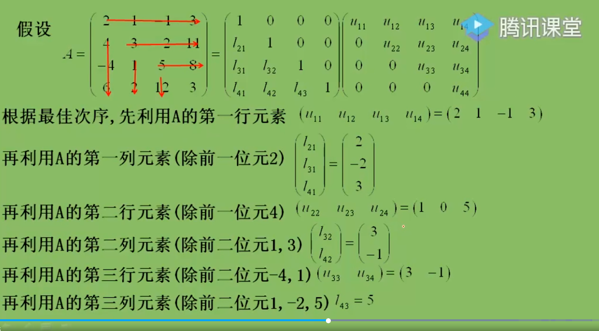
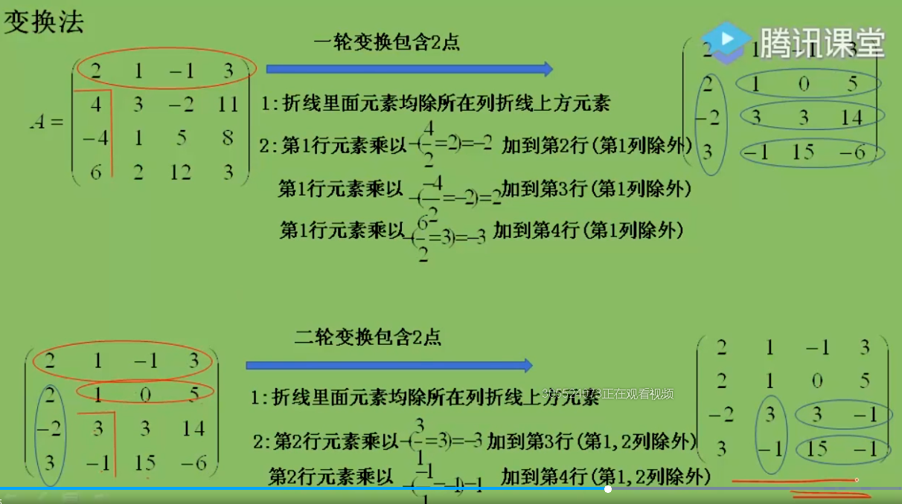
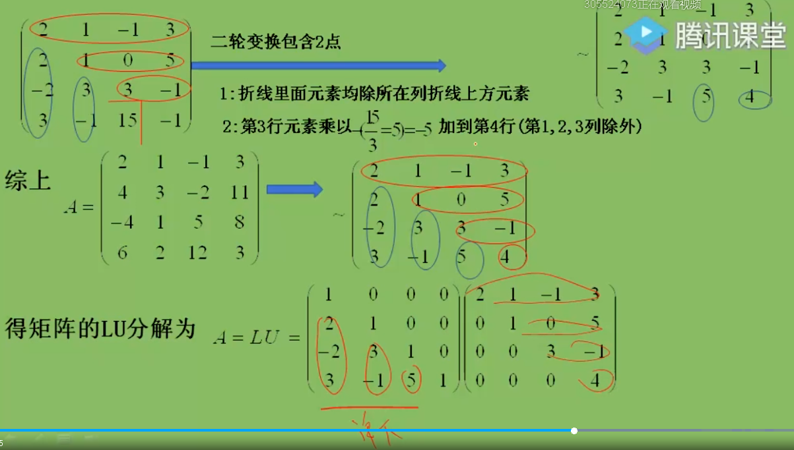
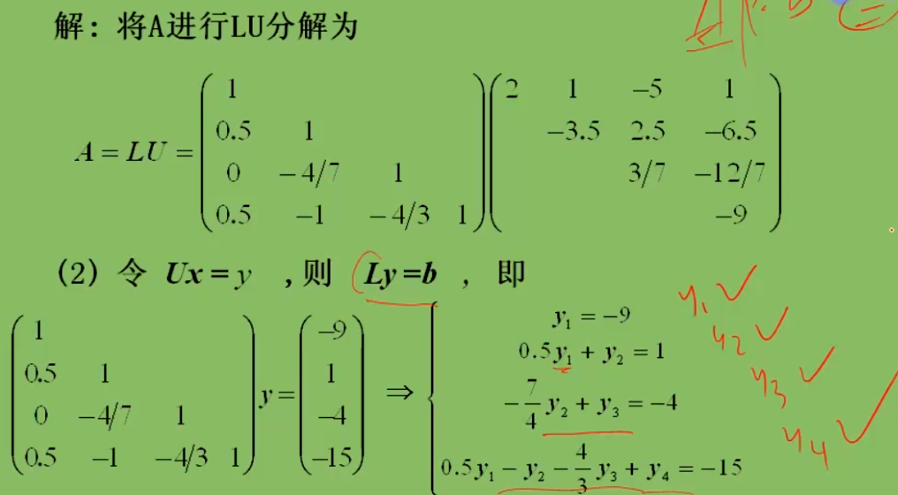
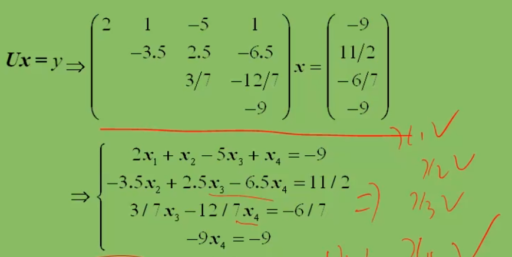
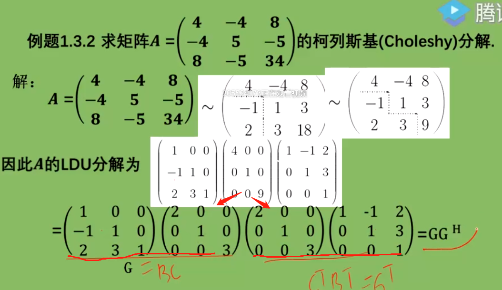

[TOC]
# 第二节矩阵分解及应用
## 一、矩阵的三角分解（LU分解）
### LU分解：
- $如果n阶矩阵A能够分解为一个下三角矩阵L和一个上三角矩阵U$的乘积，则称其为**三角分解或LU分解**
- `LU：下×上(无意义，因为可分解为无数下×上) / 单下×上 / 下×单上`
- 单位下三角矩阵×上三角，为**Doolittle分解**
- 下三角×单位上三角矩阵，为**Crout分解**
- $A$可进行LU分解的**充分条件**是$A$的$n-1$阶顺序主子式不为零

eg1.3.1：求矩阵A的Doolittle分解、LDU分解、Crout分解
$$
A = \left[\begin{array}{c}
    2 & 1 & -1 & 3
\\  4 & 3 & -2 & 11
\\ -4 & 1 & 5 & 8
\\  6 &  2 & 12 & 3
\end{array}\right] 
$$

- **直接计算法(适合考试)**：
  - 1、设：
$$
  A= 
  \left[\begin{array}{c}
        1     & 0       & 0 & 0
    \\  l_{21}       &1      & 0  & 0 
    \\  l_{31} & l_{32}  & 1 & 0
    \\   l_{41}      & l_{42}      & l_{43}   &1
    \end{array}\right]_{4 × 4}
 .
    \left[\begin{array}{c}
        u_{11}      &u_{12}       & u_{13}   &u_{14} 
    \\  0       &u_{22}       &u_{23}   &u_{24} 
    \\  0 & 0 & u_{33} & u_{34} 
    \\  0     & 0      & 0  &u_{44} 
    \end{array}\right]_{4 × 4}
$$
  - 2、`$设所得矩阵为C，先计算C的第1行，所乘元素等于矩阵A对应的元素$`
$C_{11} = 第1行×第1列 = u_{11} = 2$
$C_{12} = 第1行×第2列 = u_{12} = 1$
$C_{13} = 第1行×第3列 = u_{13} = -1$
$C_{14} = 第1行×第4列 = u_{14} = 3$
`再计算$C中除c_{11}的第1列$`
$C_{21} = 第2行×第1列 =l_{21} u_{11} = 4，得l_{21}  =2$
$C_{31} = 第3行×第1列 =l_{31} u_{11} = -4，得l_{31}  =-2$
$C_{41} = 第4行×第1列 =l_{41} u_{11} = 6，得l_{41}  = 3$
`再计算$C中除c_{21}的第2行$`
$C_{22} = 第2行×第2列 =l_{21} u_{12} +u_{22}   = 4，得u_{22}  =2$
$C_{23} = 第2行×第3列 =l_{21} u_{13} +u_{23}   = 4，得u_{23}  =6$
$C_{22} = 第2行×第2列 =l_{21} u_{12} +u_{22}   = 4，得u_{22}  =2$
$C_{24} = 第2行×第4列 =l_{21} u_{14} +u_{24}   = 4，得u_{23}  =2$
`$按行列行列的顺序$`$\cdots$

- **变换法**：
  -  `$1轮变换：画折线：第1行画圈，除a_{11}外第一列画折线，折线下边元素除a_{11} ；求蓝圈，用第1行×-2 将A第2行元素打0，用第1行乘2将A第3行元素打0，用第1行×3 将A第4行元素打0$`
  -  `$2轮变换：对象为1轮变换后除第一行第一列之外的矩阵$`

   -  `$L为蓝色的圈，对角线为1；U为红色的圈$`

### LDU分解
- 如果$A能分解为LDU$，则$A=LDU$，称为方阵$A$的$LDU$三角分解。
- **性质**：
   - $L$为**单位下三角矩阵**
   - $D$为**对角矩阵**
   - $U$为**单位上三角矩阵**
- 矩阵$A = (a_{ij})_{n×n}$的$LDU$分解式**唯一的充分且必要条件**为$A 的$( n-1)$阶顺序主子式不等于0。

$$
D_k =\left[\begin{array}{c}
    a_{11} & a_{12} & \cdots & a_{1n}
\\  a_{21} & a_{22} & \cdots & a_{2n}
\\  \vdots & \vdots & \ddots & \vdots
\\  a_{k1} & a_{k2} & \cdots & a_{kk}
\end{array}\right] ≠ 0 (k = 1,2,...n-1)
$$
> 左乘行变换，右乘列变换

###  利用三角分解求线性方程组的解
设$A$是相容方程（即方程组有解），如果$A = LU$，其中
$$
  A= 
  \left[\begin{array}{c}
    a_{11} & a_{12} & \cdots & a_{1n}
\\  a_{21} & a_{22} & \cdots & a_{2n}
\\  \vdots & \vdots & \ddots & \vdots
\\  a_{n1} & a_{n2} & \cdots & a_{nn}
\end{array}\right]=
 \left[\begin{array}{c}
        1     & 0       & \cdots & 0
    \\  l_{21}       &1      & \cdots  & 0 
    \\  \cdots & \cdots  & \cdots & 0
    \\   l_{n1}      &\cdots      & l_{n,n-1}   &1
    \end{array}\right]
 .
    \left[\begin{array}{c}
        u_{11}      &u_{12}       & \cdots   &u_{1n} 
    \\  0       &u_{22}       &\cdots   &u_{2n} 
    \\  0 & 0 & \cdots & \cdots
    \\  0     & 0      & 0  &u_{nn} 
    \end{array}\right]
$$
那么$AX = b { \ \ \ ⇔ \ \ \ } LUX = b{ \ \ \ ⇔ \ \ \ } \begin{cases}
    LU = b
\\  UX = Y
\end{cases}$

eg：
$$
A = \left[\begin{array}{c}
    2 & 1 & -5 & 1
\\  1 & -3 & 0 &- 6
\\ 0 & 2 & -1 & 2
\\  1 &  4 & -7 & 6
\end{array}\right] ，
b = \left[\begin{array}{c}
    -9 
\\  1
\\ -4 
\\  -15
\end{array}\right] （1）求A的LU分解（2）利用（1）的LU分解求解方程Ax = b
$$

### Choleshy分解
- 设$A是实对称正定矩阵。$$如果A=GG^T$，其中G是下三角矩阵，则称分解式 $A =  GG^T$为实对称正定矩阵$A$的（**Choleshy分解**）**柯列斯基分解**（也叫**平方根分解**，或**对称三角分解**）
- 实对称矩阵顺序主子式>0
- $A$是实对称正定矩阵$LDU$分解的特点：`1、L单下和U单上互为转置；2、D对角矩阵元素>0`
eg:

> $浮数取共轭，所以为G^H，实数取转置G^T即可。A^T = A^H$，浮数（a +ib）（a- ib）
## 二、矩阵的满秩分解

## 三、矩阵的正交分解（了解）
## 四、矩阵的奇异值分解（了解）